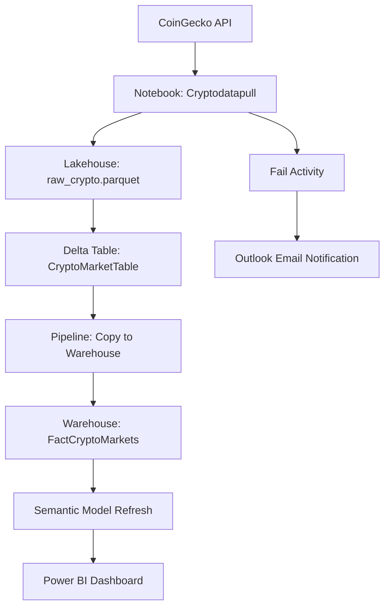

# 📊 Crypto Market Intelligence Dashboard

An end-to-end data analytics solution built with **Microsoft Fabric**, integrating live cryptocurrency data from the **CoinGecko API** into a full pipeline including Lakehouse, Delta Table, Data Warehouse, Semantic Model, and Power BI dashboard.

---


## 📚 Project Highlights

| Feature                    | Technology                |
| -------------------------- | ------------------------- |
| Data Source                | CoinGecko Public API      |
| Ingestion & Transformation | Microsoft Fabric Notebook |
| Raw & Processed Storage    | Lakehouse (Delta Table)   |
| Structured Storage         | Fabric Data Warehouse     |
| Data Modeling              | Semantic Model            |
| Reporting & Visualization  | Power BI                  |
| Automation & Orchestration | Fabric Data Pipeline      |
| Alerts & Monitoring        | Office 365 Outlook Email  |

---

## 🧰 Architecture Diagram



---

## 📁 Folder Structure

```bash
/
├── notebooks/
│   └── cryptodatapull.ipynb
├── pipeline/
│   └── cryptopipeline.json
├── images/
│   └── pipeline_screenshot.png
├── README.md
└── LICENSE
```

---

## 🔄 Workflow Summary

1. **Notebook** pulls live crypto market data from CoinGecko API.
2. Saves raw data as `.parquet` file to **Lakehouse**.
3. Converts raw data into a **Delta Table**.
4. **Copy Activity** sends data to **Data Warehouse**.
5. **Semantic Model Refresh** triggers Power BI dataset update.
6. **Fail Path** sends email via Office 365 on errors.

---

## 📃 Notebook Code (PySpark)

```python
import requests
import pandas as pd

# Step 1: API Call
url = "https://api.coingecko.com/api/v3/coins/markets"
params = {
    "vs_currency": "usd",
    "order": "market_cap_desc",
    "per_page": 50,
    "page": 1,
    "sparkline": False
}
response = requests.get(url, params=params)
data = response.json()

# Step 2: Pandas DataFrame
pdf = pd.json_normalize(data)
pdf = pdf[["id", "symbol", "name", "current_price", "market_cap",
           "total_volume", "price_change_percentage_24h", "last_updated"]]

# Step 3: Convert to Spark DataFrame
sdf = spark.createDataFrame(pdf)

# Step 4: Save as Delta Table
sdf.write.format("delta").mode("overwrite").saveAsTable("CryptoMarketTable")
```

---

## 🏦 Lakehouse and Warehouse

### Lakehouse Contents

```
Files/
└── Crypto/
    └── raw_crypto.parquet

Tables/
└── CryptoMarketTable (Delta)
```

### Data Warehouse Table

```
FactCryptoMarkets
- id
- symbol
- name
- current_price
- market_cap
- total_volume
- price_change_percentage_24h
- last_updated
```

---

## 🧱 Semantic Model

### Measures (DAX)

```DAX
AveragePrice = AVERAGE(FactCryptoMarkets[current_price])
TotalMarketCap = SUM(FactCryptoMarkets[market_cap])
PriceChange24h = AVERAGE(FactCryptoMarkets[price_change_percentage_24h])
```

### Dimensions

* Name
* Symbol
* Date (from `last_updated`)

---

## 📊 Power BI Dashboard Ideas

* **KPI Tiles**: Total Market Cap, Average Price, 24h % Change
* **Line Chart**: BTC/ETH price trend
* **Bar Chart**: Top 10 Coins by Market Cap
* **Table**: Full Coin Snapshot

---

## ⏰ Automation & Alerting

* **Scheduled Pipeline**: Daily/hourly refreshes
* **Failure Alerts**: Sent via Office 365 Outlook connector

---

## 📍 Setup Instructions

1. Create a Lakehouse and Warehouse in Microsoft Fabric
2. Import and run `cryptodatapull` notebook
3. Configure pipeline with Copy activity, Semantic model refresh, and Fail+Outlook path
4. Build Semantic Model in Power BI
5. Design your dashboard and publish it

---

## 📅 Scheduling

* Recommended: Daily refresh at 8am UTC
* Optional: Every hour for live tracking

---

Made with ❤️ using Microsoft Fabric & Power BI.

> Reach out at: \[[your@email.com](mailto:your@email.com)] or open an issue.
